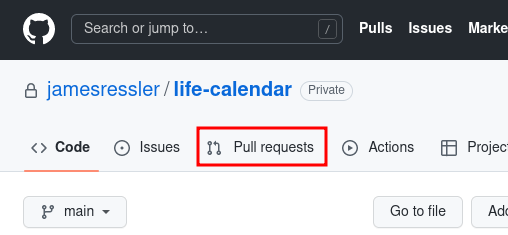

# Contributing
To contribute to this project, fork the repo, clone your fork, and create a new branch for the feature or bug you intend to work on.

## Branch naming conventions:
### Format
```lc-<developer>-<component>-<description>-<issue>```

### Developer Options
|Developer Name|Convention|
|---|---|
|James Ressler|`jress`|
|Sean Humm|`shumm`|
|Logan Peticolas|`lpeti`|

### Component Options
|Component Name|Convention|
|---|---|
|UI/UX|`ui`|
|Database|`db`|
|Test Suite|`test`|

### Description Example
|Example Description|Example Convention|
|---|---|
|Adding a button to toggle dark mode|`darkmodebutton`|

### Issue Options
|Issue Name|Convention|
|---|---|
|Feature|`feat`|
|Bug|`bug`|

# Style Requirements

## Refactor Bloaters
Nobody wants to read and decipher spaghetti code. Keep your code modular. Break it into manageable, maintainable logical units.

## Keep it (human) Readable
Code should convey intent with clear class, method, and variable names.

## Delete Dead and Unreachable Code
Do not leave huge blocks of commented out code in your commits because you might want to reference it later. Additionally, do not leave unreachable code in your commits.
```c++
private bool IsXOne(int x) {
  if (x == 1) {
    return true;
  }
  return false;

  if (x == 2) {
    // this whole expression is unreachable
  }
}
```

## Decompose Complicated Conditionals
Complex expressions are hard to read and are a breeding ground for bugs. Decompose long conditionals.

```c++
// NO
if((x > 0 && x < 10) && x != 7) {
  return true;
}

// YES
if(IsXZeroToNine(x) && !IsXSeven(x)) {
  return true;
}

private bool IsXZeroToNine(int x) {
  if(x > 0 && x < 10) {
    return true;
  }
  return false;
}

private bool IsXSeven(int x) {
  if(x == 7) {
    return true;
  }
  return false;
}
```
Kind of a goofy example with ints but the principle will keep the code readable when working with more complex conditionals.

## Avoid Magic Numbers
It is difficult to derive meaning from a literal number, even if we are the ones that put it there. Assign literal numbers to a constant.

```c++
// NO
return (52 * 40);

// YES
const int weeksInAYear = 52;
const int hoursInAWeek = 40;

return (weeksInAYear * hoursInAWeek);
```

## What to Comment
Limit comments to information that is not readily understood from reading the code (see [Keep it (human) Readable](#-Keep-it-(human)-Readable)) or to explain an external limitation.

```c++
const int weeksInAYear = 52;

// OSHA RestAPI will only accept values between 20 and 60
const int hoursInAWeek = 40;

return (weeksInAYear * hoursInAWeek);
```

# Commiting Your Changes
> Commit often, push once.

Frequent commits make review easier and saves a lot of headache if rollbacks are necessary. You can push more than once, if necessary. If your have an open pull request, new pushes will automatically be added to it.

# Git Quickstart
## Setup
```bash
# Clone your fork of the repo into the current directory
git clone https://github.com/<your-username>/life-calendar.git
# Navigate to the newly cloned directory
cd life-calendar
# Assign the original repo to a remote called "upstream"
git remote add upstream https://github.com/jamesressler/life-calendar.git
```

## Get Changes from Upstream
```bash
git pull --rebase upstream main
```

## Push Your Changes to Your Fork
```bash
git push origin
```

## Open a Pull Request
Finally, go to the [upstream repository](https://github.com/jamesressler/life-calendar) on GitHub and open a pull request.

